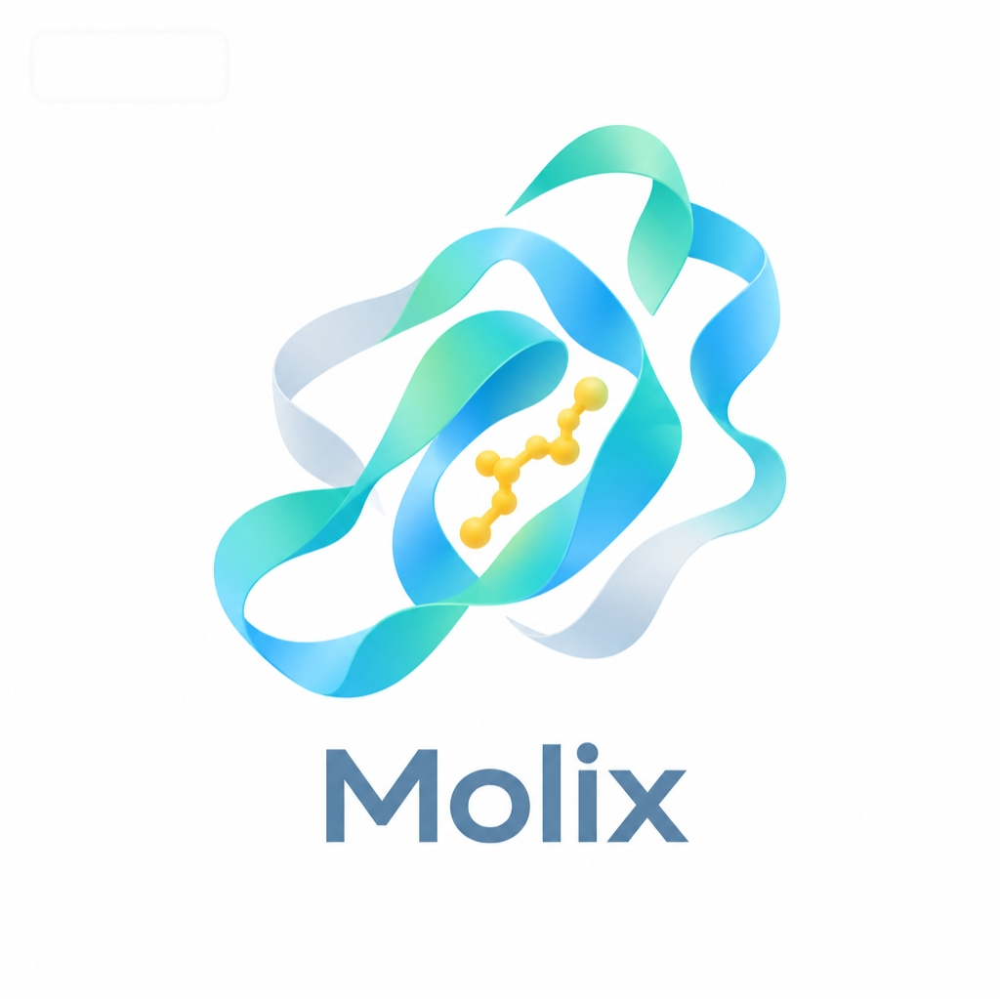

# Molix

**分子全流程定制服务**

---

Molix 用 AI 帮助药物、材料和化学研发团队在合成之前预测分子性质、生成候选分子、筛选最优方案。

从"设计分子"到"评估分子"，全流程一站式服务。

---

## 我们能做什么

| 🧠 **模型训练** | ⚗️ **分子合成** |
|:---:|:---:|
| 高精度预测模型 | 合成路线设计 |
| 🔍 **分子筛选** | 📊 **ADMET预测** |
| 多维度虚拟筛选 | 药代动力学评估 |

---

## 成果展示

**条件分子生成** — 根据目标性质反向生成候选分子

**ADMET 预测报告**

---

## 为什么选择我们

- 🎯 **全流程覆盖** — 从生成到评估，一家搞定
- 🔬 **数据安全** — 严格保密，不外泄
- 📈 **持续优化** — 合作越久，效果越好
- 🧪 **实验对接** — 不止预测，还能验证

---

## 联系我们

**扫描微信，添加 Molix 团队**

首次咨询 · 免费评估数据可行性

---

© 2026 Molix

