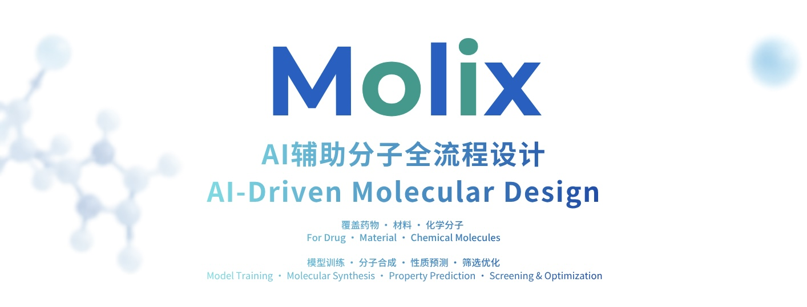
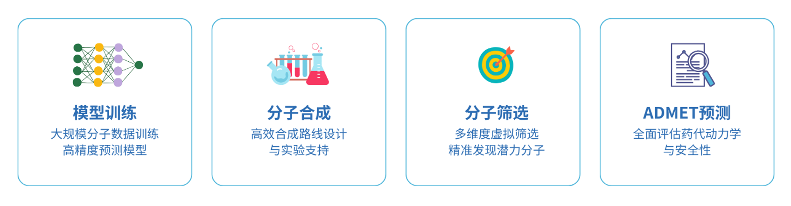
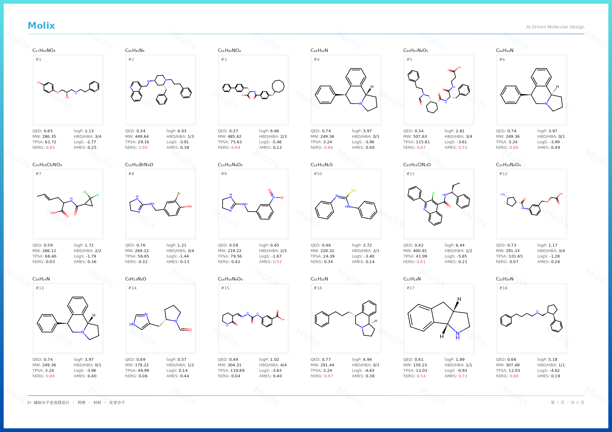
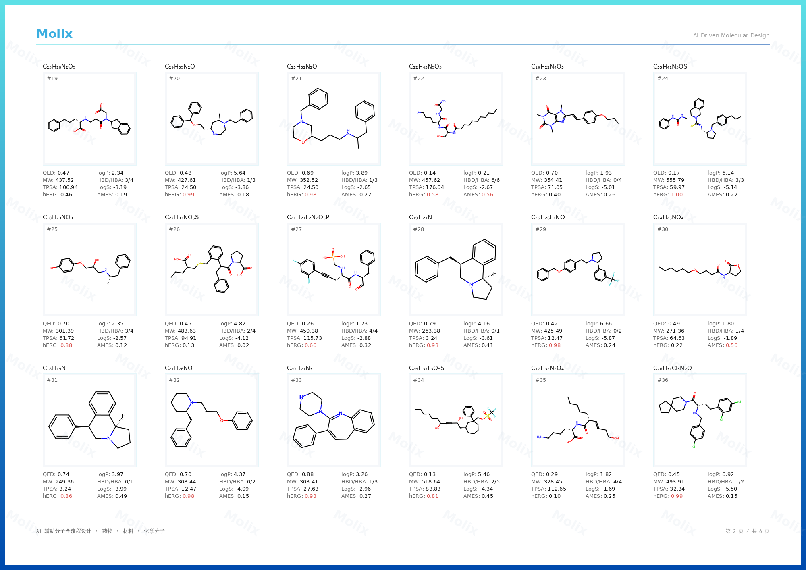

[中文](README.md) · [English](README_EN.md)

## 关于我们
Molix 是一家专注于分子人工智能的技术团队，致力于将 AI 技术应用于药物发现、材料设计与化学研发的早期阶段。

我们为药物、材料和化学研发团队提供分子生成、模型训练、分子筛选与性质预测四项核心服务，覆盖从候选分子设计到成药性评估的关键环节。

**核心价值：** 通过 AI 预测替代部分早期实验筛选，帮助客户缩短研发周期、降低试错成本，让研发资源更聚焦于高潜力分子。

## 核心能力

### 🧠 模型训练
- 整合分子数据与 AI 算法，构建面向特定任务的预测模型。
- 覆盖靶点活性、理化性质、代谢稳定性与安全性等关键成药性指标，支持基于客户数据的定制化训练。

### ⚗️ 分子生成
- 基于生成式 AI 模型，根据目标性质或结构约束反向生成候选分子。
- 支持分子骨架、官能团、分子量、LogP 等多维度约束条件，生成结果可直接进入性质预测与筛选环节。

### 🔍 分子筛选
- 支持大规模分子库的快速虚拟筛选，多性质同步评估。
- 输出优先推荐候选分子列表，支持后续实验验证与优化。

### 📊 ADMET 预测

覆盖吸收、分布、代谢、排泄、毒性五大 ADMET 维度。
提供 ADMET 性质预测与优化建议，支持成药性评估决策。

- **吸收（A）**：Caco-2 渗透性、水溶性、P-gp 底物

- **分布（D）**：血浆蛋白结合率、血脑屏障穿透

- **代谢（M）**：CYP450 酶抑制、肝微粒体稳定性

- **排泄（E）**：清除率、半衰期预测

- **毒性（T）**：hERG 心脏毒性、Ames 致突变性、肝毒性

## 成果展示

### 分子生成

根据目标性质反向生成候选分子，满足多样化的设计需求。

*（以上为 Molix 生成的部分候选分子示例）*

### ADMET 预测报告

*（以上为 Molix 生成的 ADMET 评估报告示例）*

## 为什么选择 Molix？

**🎯 服务覆盖**
从分子生成到性质评估，提供多个环节的服务，按需组合。

**🔬 数据保密**
客户数据严格保密，不用于其他项目，可按需签署保密协议。

**📈 模型迭代**
可根据客户反馈和数据积累，持续优化模型表现。

**🧪 实验对接**
可对接合作实验室，协助客户完成从预测到验证的流程。

## 联系我们

- 📧 **邮箱**：[Molix.AITeam@gmail.com](mailto:Molix.AITeam@outlook.com)
- 💬 **WhatsApp**：[+86 15999510273](https://wa.me/8615999510273)
- 💚 **LINE**：[Molix_team]
- 📱 **微信**：扫描下方二维码添加 Molix 团队

*首次咨询 · 免费评估您的数据可行性*

© 2026 Molix · All rights reserved

