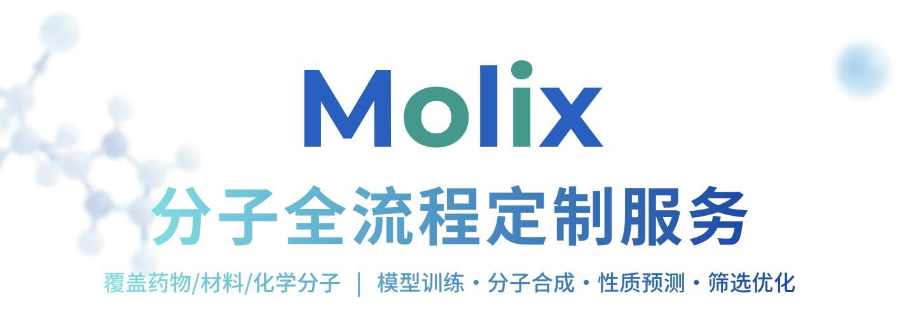
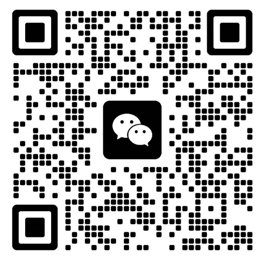

# Molix

**分子 AI 定制服务**

Molix 是一家专注于分子人工智能的团队。

我们用 AI 技术，帮助药物、材料和化学研发团队
在**合成之前**就能预测分子性质、生成候选分子、筛选最优方案。

## 核心能力

### 🧠 模型训练

- 基于大规模分子数据，训练高精度预测模型。

- 覆盖溶解度、毒性、稳定性、活性等核心性质，根据客户数据定制。

### ⚗️ 分子合成

- 用 AI 辅助设计合成路线，评估可行性与成本。

- 对接合作实验室，完成从设计到合成的闭环。

### 🔍 分子筛选

- 从大规模分子库中快速筛选候选，多性质同时评估。

- 输出优先推荐列表，直接送入实验验证。

### 📊 ADMET 预测

- 全面评估药代动力学与安全性。

- 覆盖吸收、分布、代谢、排泄、毒性五大维度，输出可读的评估报告。

## 成果展示

### 条件分子生成

根据目标性质反向生成候选分子，满足多样化的设计需求。

*（以上为 Molix 生成的部分候选分子示例）*

---

### ADMET 预测报告

*（以上为 Molix 生成的 ADMET 评估报告示例）*

---

## 为什么选择 Molix

**🎯 全流程覆盖**
从"生成分子"到"评估分子"，不用找多家供应商，我们一家搞定。

**🔬 数据安全**
所有客户数据严格保密，不使用、不泄露、不用于其他项目。

**📈 持续优化**
根据客户反馈和新数据，模型精度不断提升，合作越久效果越好。

**🧪 实验对接**
不止于 AI 预测，还能对接合作实验室，从"计算"到"验证"闭环完成。

---

## 联系我们

### 想了解更多？欢迎交流

**扫描微信，添加 Molix 团队**

*首次咨询 · 免费评估您的数据可行性*

---

💻 [github.com/DuckZh/Molix](https://github.com/DuckZh/Molix)

---

© 2026 Molix · All rights reserved

